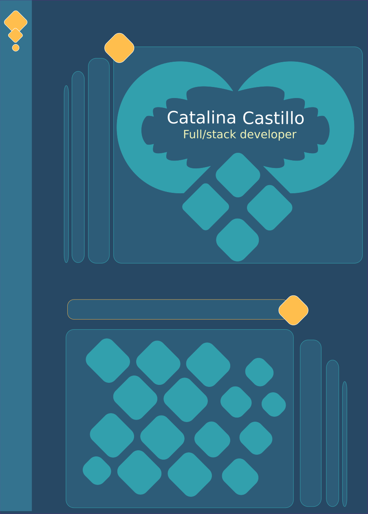
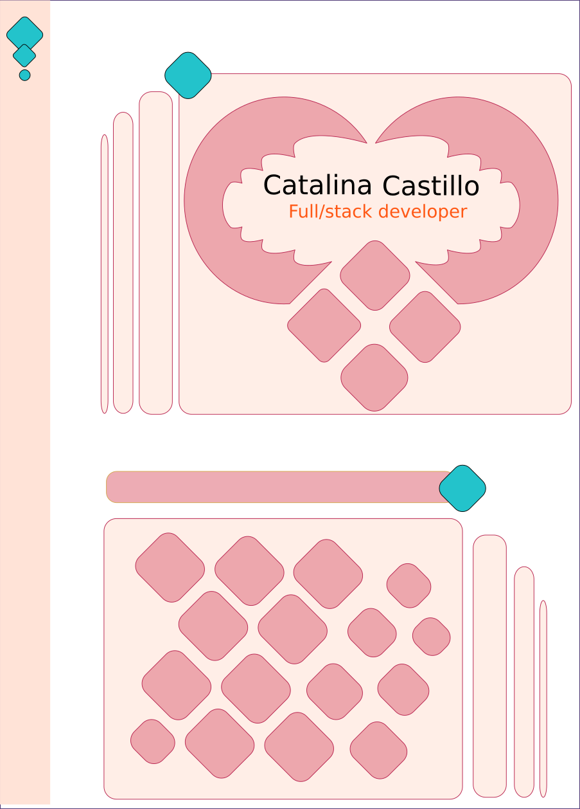
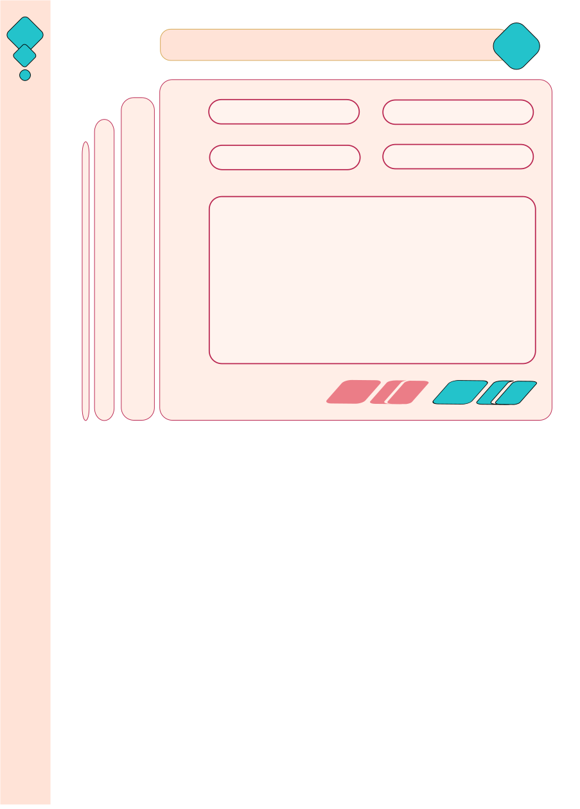

# Objetivo de proyecto:
Generar plataforma donde recaude proyectos, tanto cientificos como artisticos.

## Tabla contenido:
1. Estructura
    *
2. FrontEnd 
    *
3. BackEnd
    *
4. DataBase
    *

## Ideas de implementacion

## MockUp

* Primera idea para tema "Dark"

    
    

* Primera idea para tema "Light"

    

    

## Estado de avance:
* [] Creacion de Estructura y mockup
* [] Definicion de clases
* [] Definicion de base de datos y relaciones
* [] Creacion de Base de datos

* ### [] BackEnd:
    * [] services
    * [] clases/modelos
    * [] controlador
    * [] Api
    * [] Dependencias

* ### [] FrontEnd:
    * [] NavBar
    * [] CSS
    * [] JS
    * [] HTML 

* [] Host 
* [] Publicar

## Versiones

* Version 0.1
    

